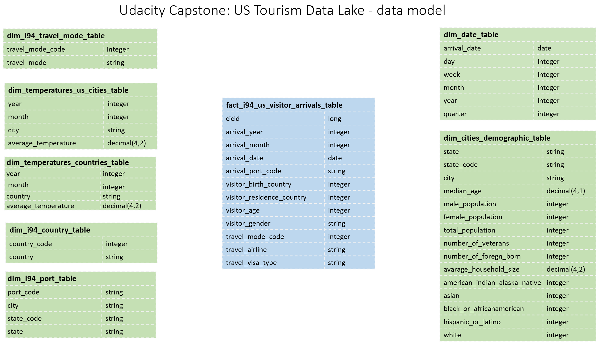

# Udacity Capstone: US Tourism Data Lake
## Data Engineering Capstone Project
The Project is an exercise to practice what I have learnt through Udacity Data Engineering Program.
I chose to use given datasets to build a Data Lake.

## Structure of the Project

Following the Udacity guide for this project, the structure is as shown below:

- Step 1: Scope the Project and Gather Data
- Step 2: Explore and Assess the Data
- Step 3: Define the Data Model
- Step 4: Run ETL to Model the Data
- Step 5: Complete Project Write Up

### Step 1: Scope the Project and Gather Data

#### Scope 
Scenario: Tourism Agency Sales team would like to plan their advertisement budget by Analytic department's recommendation. The relation between the US cities and visitor's profile is the key value for Sales team. Data Analyst and Data Scientists define their goal to find out:
   - Correlation between US Cities temperature and Visitor's Residency Country temperature
   - Correlation between US Cities demography and Visitor's Nationality
   - How to categorise the Visitors profile by US cities
   - Is there trend (weekly, monthly, quarterly) 

Data Engineer makes a data lake with a proper data model that makes easy to understand and access.

#### Describe and Gather Data 

In order to satisfy the goal, it requires information about US visitors, US Cities demography, the temperature of US cities and other Countries.

#### Data Source:
   - I94 Immigration: Non-U.S. Resident Visitor Arrivals to the United States are registered and anonymous information are available in National Travel and Tourism Office website(https://www.trade.gov/i-94-arrivals-program) The immigration data includes massive information and millions of visitors’ registry per month. This dataset is a major source to extract Visitors profiles. 
   - I94 SAS LABELS DESCRIPTIONS: This is given by the project, It is an SAS label description file that includes I94 Immigration datasets description and supplementary information about the codes used in the datasets. 
   - World Temperature Data: This dataset came from Kaggle. The data source is (https://www.kaggle.com/berkeleyearth/climate-change-earth-surface-temperature-data). The dataset includes Country, City average temperature as daily basis. This dataset is useful to extract average temperature for US cities and Visitors' countries. 
   - U.S. City Demographic Data: This data comes from OpenSoft. The data source is (https://public.opendatasoft.com/explore/dataset/us-cities-demographics/export/). The dataset includes population details and different races count for each US cities. This dataset is useful to extract Cities demography.
   
#### Tools
It is written in python programming language with pyspark libraries to get benefit of Apache Spark. This solution is designed to run on Amazon Web Services cloud and to store Apache Parquet files on AWS S3 Buckets.

### Step 2: Explore and Assess the Data
#### Explore the Data 
In order to identify data quality issues, these spark functions are used:
- show(10) first 10 rows to review
- printSchema() to observe data types
- summary().show() to basic data statistic to understand dataset.
- countDistinct() to count unique values on spesific columns.

#### Cleaning Steps
In order to clean the data, these spark functions are used:
- na.drop() to drop rows that has na values on specified columns.
- filter() to narrow down data to target information.
- dropDuplicates() to drop duplicated row based on specifide columns.
- isNotNull() to filter out null rows for targeted columns.

### Step 3: Define the Data Model
#### 3.1 Conceptual Data Model

Star Schema model has been applied due to the fact that Star Schema makes analysis easier for our Data Analytic team. 

There is one Fact table in center with information extract from Immigration data. 
Dimension tables have connection to Fact table with uniq key set. Dimention tables could be used to enrich the fact table by join queries. 



#### 3.2 Mapping Out Data Pipelines
List the steps necessary to pipeline the data into the chosen data model
1. Build a spark session
2. Process Temperature Data
    - Load and clean Temperature data 
    - Filter "United States" temperature data and aggregate into dim_temperatures_us_cities_table
    - Write dim_temperatures_us_cities_table to parquet files partitioned by year and month
    - Filter out "United States" temperature data and aggregate into dim_temperatures_us_cities_table
    - Write dim_temperatures_countries_table to parquet files partitioned by year and month
3. Process Cities Demographic Data
    - Load and clean Cities Demographic data 
    - Aggregate Cities Demographic dataframe by Race with Count
    - Write dim_cities_demographic_table to parquet files
4. Process I94 SAS Labels Data
    - Load, clean and parse i94_sas_labels data
    - Generate dim_i94_country_table and write to parquet files
    - Generate dim_i94_port_table and write to parquet files
    - Generate dim_i94_travel_mode_table and write to parquet files
5. Process Immigration I94 Data
    - Load and clean Immigration I94 data
    - Filter visitor data that visited for pleasure
    - Convert sasdate to datetime
    - Generate dim_date_table and write to parquet files partitioned by year and month
    - Generate fact_i94_us_visitor_arrivals_table and write to parquet files partitioned by arrival_year and arrival_month
    - 
### Step 4: Run Pipelines to Model the Data 
#### 4.1 Create the data model
Build the data pipelines to create the data model.

'etl.py' can parse data and create/update the data model as Data Pipeline.

```bash
python3 etl.py
```

#### 4.2 Data Quality Checks
Explain the data quality checks you'll perform to ensure the pipeline ran as expected. These could include:
 * Integrity constraints on the relational database (e.g., unique key, data type, etc.)
 * Unit tests for the scripts to ensure they are doing the right thing
 * Source/Count checks to ensure completeness
 
Run Quality Checks

#### 4.3 Data dictionary 
Create a data dictionary for your data model. For each field, provide a brief description of what the data is and where it came from. You can include the data dictionary in the notebook or in a separate file.

#### DICTIONARY - fact_i94_us_visitor_arrivals_table
| Column Name               | Descriptions                                                                         |
|---------------------------|--------------------------------------------------------------------------------------|
| cicid                     | Uniq id for   non-us visitors i94 entry form                                         |
| arrival_year              | Arrival Year as YYYY                                                                 |
| arrival_month             | Arrival Month as MM                                                                  |
| arrival_date              | Arrival date to US as   YYYY-MM-DD format                                            |
| arrival_port_code         | Arrival Port code as   3 digits String                                               |
| visitor_birth_country     | Visiter's nationality   country as 3 digits integer                                  |
| visitor_residence_country | Visiter's residence   country as 3 digits integer                                    |
| visitor_age               | Age of Visitor in   Years                                                            |
| visitor_gender            | Visiter's Sex                                                                        |
| travel_mode_code          | Transportation   mode, there are missing values as well as not reported (9)          |
| travel_airline            | Airline used to   arrive in U.S.                                                     |
| travel_visa_type          | Class of admission   legally admitting the non-immigrant to temporarily stay in U.S. |

#### DICTIONARY - dim_date_table
| Column Name                      | Descriptions                                                      |
|----------------------------------|-------------------------------------------------------------------|
| arriving_date                    | Arrival date to US as   YYYY-MM-DD format                         |
| day                              | Arrival Day to US                                                 |
| week                             | Arrival Week number   to US                                       |
| month                            | Arrival Month number   to US                                      |
| year                             | Arrival Year to US                                                |
| quarter                          | Arrival Quarter   number to US                                    |

#### DICTIONARY - dim_temperatures_us_cities_table
| Column Name                      | Descriptions                                                      |
|----------------------------------|-------------------------------------------------------------------|
| year                             | Year of temperature record                                        |
| month                            | Month number of temperature record                                |
| city                             | US city name of temperature record                                |
| average_temperature              | Monthly Average temperature for given US city                     |


#### DICTIONARY - dim_temperatures_countries_table
| Column Name                      | Descriptions                                                      |
|----------------------------------|-------------------------------------------------------------------|
| year                             | Year of temperature record                                        |
| month                            | Month number of temperature record                                |
| country                          | Country name of temperature record                                |
| average_temperature              | Monthly Average temperature for given Country                     |

#### DICTIONARY - dim_cities_demographic_table
| Column Name                      | Descriptions                                                      |
|----------------------------------|-------------------------------------------------------------------|
| state                            | US state name                                                     |
| state_code                       | US state code as 2 letters                                        |
| city                             | US city name                                                      |
| median_age                       | The median of the age of the   population                         |
| male_population                  | Number of the   male population                                   |
| female_population                | Number of the   female population                                 |
| total_population                 | Number of the   total population                                  |
| number_of_veterans               | Number of   veterans residents in given city                      |
| number_of_foregn_born            | Number of residents who born in   foregn country                  |
| avarage_household_size           | Average size of houses in given   city                            |
| american_indian_alaska_native    | Number of american indian alaska   native residents in given city |
| asian                            | Number of asian   residents in given city                         |
| black_or_africanamerican         | Number of black   or african-american residents in given city     |
| hispanic_or_latino               | Number of   hispanic or latino residents in given city            |
| white                            | Number of white   residents in given city                         |

#### DICTIONARY - dim_i94_country_table
| Column Name                      | Descriptions                                                      |
|----------------------------------|-------------------------------------------------------------------|
| country_code                     | 3 digits integer code stands for   country                        |
| country                          | Country name                                                      |

#### DICTIONARY - dim_i94_port_table
| Column Name                      | Descriptions                                                      |
|----------------------------------|-------------------------------------------------------------------|
| port_code                        | 3 letters code stands for Ports                                   |
| city                             | City name                                                         |
| state_code                       | 2 letters code stands for US   States                             |
| state                            | US States name                                                    |

#### DICTIONARY - dim_i94_travel_mode_table
| Column Name                      | Descriptions                                                      |
|----------------------------------|-------------------------------------------------------------------|
| travel_mode_code                 | 1 digit for mode of trasnsportation                               |
| travel_mode                      | Mode of transportation                                            |

#### Step 5: Complete Project Write Up

* **Clearly state the rationale for the choice of tools and technologies for the project:**

  It is built to run on AWS Cloud due to the fact that the source data is huge, it requires high processing power and storage that can not be handled on a local PC. AWS S3 Bucket is scalable and faster to access from processing Unit. The Pipeline run periodically so we will use some resources occasionally. AWS Cloud Services provide cheaper solution called "pay as you go" that is fitting well for our design as a cost-effective solution. Apache Spark is immensely powerful to process data faster in a parallel and failure tolerant way. Apache Spark has several built-in libraries that makes easy by selecting familiar methods.


* **Propose how often the data should be updated and why:**

  The Data Pipeline can be run by monthly due to the fact output parquet files are partitioned by year and month. So, it will make sense to parse I94 Immigration data and   temperature data monthly, however US City Demographics data is not frequently updated like once a decade so it might be run when the source data updated.


* Write a description of how you would approach the problem differently under the following scenarios:
 * **The data was increased by 100x:**
   For storage perspective, Amazon S3 Bucket is already right solution and can be scaled. For data processing purpuso Apache Spark can be deployed in AWS EMR as a cluster to increase processing capacity. 
   
 * **The data populates a dashboard that must be updated on a daily basis by 7am every day:**
   APACHE AIRFLOW is the solution for scheduling Pipeline and monitor the processes on a simple dashboard. 
   
 * **The database needed to be accessed by 100+ people:**
   AWS REDSHIFT could be a smart solution to make the output data accessible for 100+ people since it is easy to scale our Apache parquet files to AWS REDSHIFT cluster that can be queried by many people concurrently.

